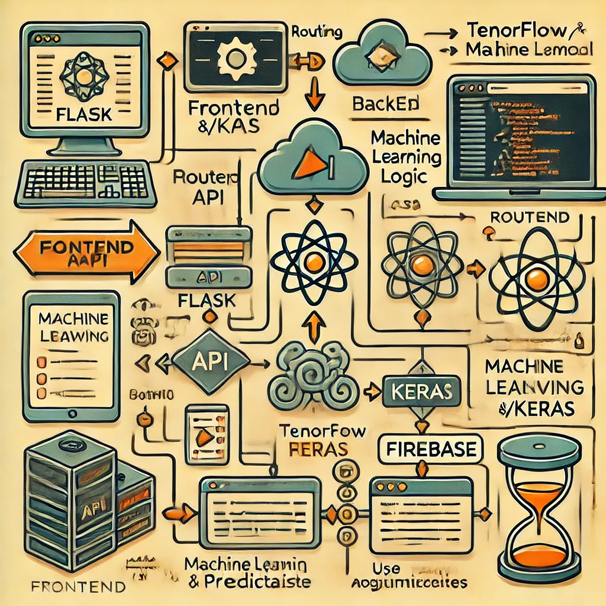

# Documentación Técnica



## i. Descripción de la arquitectura del sistema

El sistema está compuesto por los siguientes componentes principales:

- **Backend:** Flask
- **Frontend:** HTML, CSS
- **Modelo de Machine Learning:** TensorFlow/Keras
- **Autenticación:** Firebase

## Justificación de la selección de tecnologías

### Flask
Flask es un microframework de Python que permite desarrollar aplicaciones web de manera rápida y sencilla. Su simplicidad y flexibilidad lo hacen ideal para proyectos que no requieren la complejidad de frameworks más grandes como Django. Además, su amplia comunidad y documentación facilitan la resolución de problemas y la integración con otras tecnologías.

### HTML y CSS
HTML y CSS son las tecnologías estándar para la creación de interfaces web. HTML proporciona la estructura del contenido, mientras que CSS se encarga del diseño y la presentación visual. Estas tecnologías son ampliamente soportadas por todos los navegadores y permiten crear interfaces de usuario atractivas y responsivas.

### TensorFlow/Keras
TensorFlow es una de las bibliotecas más populares para el desarrollo de modelos de aprendizaje automático. Keras, que es una API de alto nivel para TensorFlow, simplifica la construcción y el entrenamiento de modelos de deep learning. La combinación de ambas herramientas permite desarrollar modelos robustos y eficientes para tareas de predicción.

### Firebase
Firebase es una plataforma de desarrollo de aplicaciones que proporciona una solución completa para la autenticación de usuarios, almacenamiento de datos y hosting. Su integración con aplicaciones web y móviles es sencilla y segura, lo que facilita la implementación de funcionalidades de autenticación y gestión de usuarios.


La estructura del proyecto es la siguiente:

```
├── src/
│   ├── __init__.py
│   ├── config.py
│   ├── providers/
│   │   ├── firebase.py
│   │   ├── model.py
│   │   └── __init__.py
│   ├── static/
│   │   ├── styles.css
│   │   └── dashboard.css
│   └── templates/
│       ├── login.html
│       ├── register.html
│       └── dashboard.html
├── .gitignore
├── requirements.txt
└── README.md
```

## ii. Historias de usuario

Las historias de usuario se pueden encontrar en el siguiente enlace: [GitHub Projects](https://github.com/users/pollog09/projects/4)

## iii. Detalle del proceso de desarrollo del modelo y sistema

1. **Recolección de Datos:**
    - Los datos se encuentran en el archivo `model/data/diabetes.csv`.

2. **Desarrollo del Modelo:**
    - El modelo se desarrolló utilizando un Jupyter Notebook, que se encuentra en `model/DIABETES_MODELO.ipynb`.
    - Se utilizó TensorFlow/Keras para construir y entrenar el modelo.

3. **Integración del Modelo:**
    - El modelo entrenado se guarda en `model/diabetes_model.h5`.
    - El modelo se carga y utiliza en el archivo [`src/providers/model.py`](src/providers/model.py).

4. **Desarrollo del Sistema:**
    - El backend se desarrolló utilizando Flask y se encuentra en [`src/__init__.py`](src/__init__.py).
    - El frontend se desarrolló utilizando HTML y CSS, con plantillas en [`src/templates/`](src/templates/) y estilos en [`src/static/`](src/static/).

## iv. Funcionalidades implementadas

- **Autenticación de Usuarios:**
    - Registro y login de usuarios utilizando Firebase.
    - Recuperación de contraseña.

- **Dashboard:**
    - Formulario para ingresar datos del paciente.
    - Predicción de diabetes basada en los datos ingresados.

- **Historial:**
    - Guardado y visualización del historial de predicciones.

## v. Problemas conocidos y encontrados

- **Problemas de compatibilidad con GPU:**
    - Algunos usuarios pueden encontrar problemas al intentar utilizar la GPU para el entrenamiento del modelo. Ver más detalles en los mensajes de advertencia en `model/DIABETES_MODELO.ipynb`.

- **Validación de formularios:**
    - La validación de formularios en el frontend es básica y podría mejorarse para una mejor experiencia de usuario.

## vi. Recomendaciones y conclusiones

- **Mejorar la validación de formularios:**
    - Implementar validaciones más robustas en el frontend para mejorar la experiencia del usuario.

- **Optimización del modelo:**
    - Continuar experimentando con diferentes hiperparámetros y arquitecturas de modelo para mejorar la precisión.

- **Documentación:**
    - Mantener la documentación actualizada y agregar más detalles sobre el proceso de desarrollo y las decisiones tomadas.

- **Pruebas:**
    - Implementar pruebas unitarias y de integración para asegurar la calidad del código y la funcionalidad del sistema.